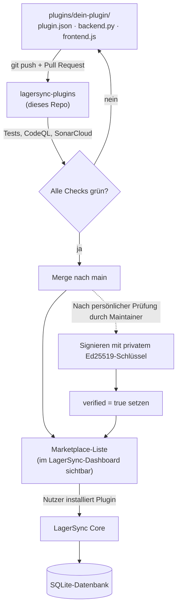
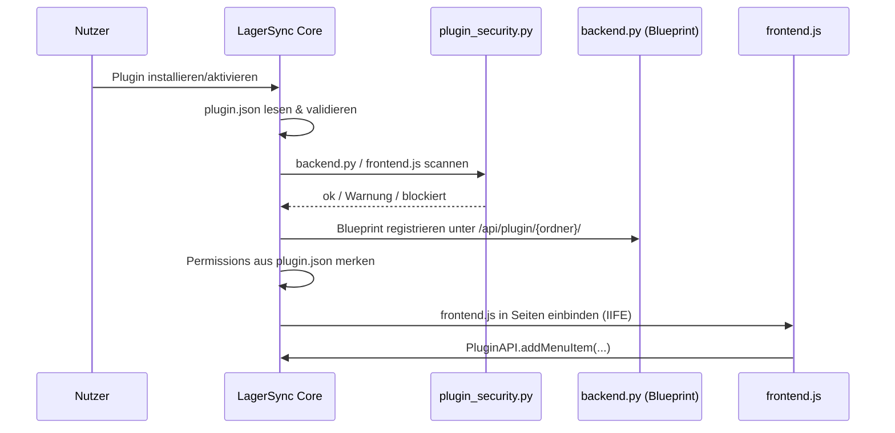
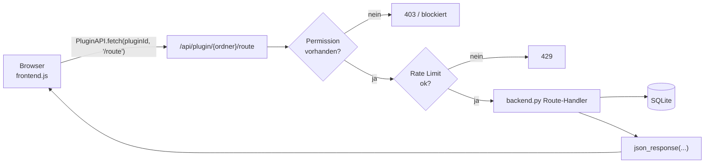
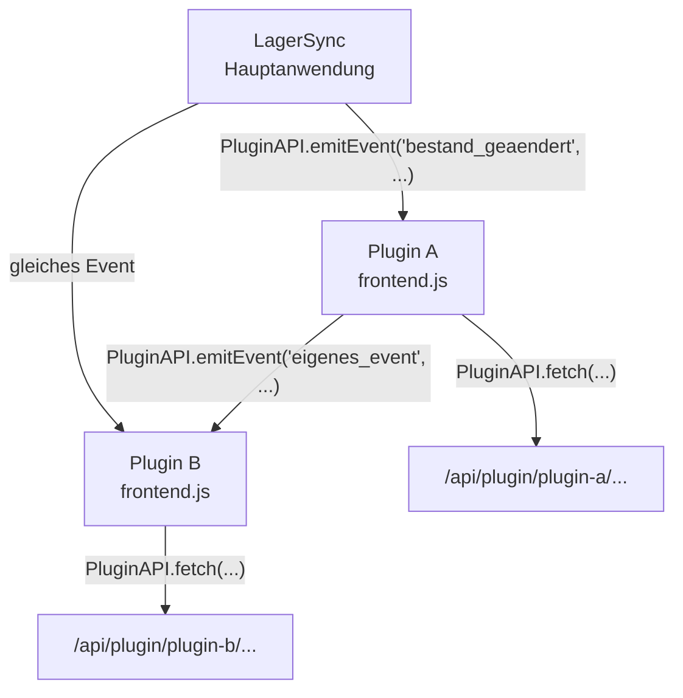

# 🏗 Architecture

Wie ein Plugin technisch in LagerSync landet – hilfreich, wenn du verstehen willst, was beim Installieren eigentlich passiert, und ziemlich praktisch, wenn eine KI dir Plugin-Code schreiben soll und erst den Überblick braucht.

## Der grobe Weg



Dieses Repo ist nur der Marketplace – Quellcode plus automatisierte Checks, keine eigene Laufzeitlogik. Geladen und ausgeführt wird ein Plugin von der eigentlichen LagerSync-Anwendung, nicht von hier.

## Was beim Laden eines Plugins passiert



Permission-Check, Signatur-Prüfung und Code-Scan laufen serverseitig bei jedem Laden, nicht nur einmal bei der PR-Review – Details in [SECURITY.md](SECURITY.md).

## Die drei Teile eines Plugins

```
plugins/
└── mein-plugin/
    ├── plugin.json     ← Manifest: Name, Version, Permissions (Pflicht)
    ├── plugin.sig       ← Ed25519-Signatur (nur verifizierte Plugins)
    ├── backend.py       ← Flask Blueprint, läuft serverseitig (optional)
    └── frontend.js       ← Browser-Code, läuft im Client (optional)
```

| Datei | Läuft wo | Was wird injiziert |
|---|---|---|
| `plugin.json` | wird vom Core gelesen | – |
| `backend.py` | im Flask-Prozess von LagerSync | `get_db_connection()`, `require_auth()`, `json_response()`, `session`, ... siehe [PLUGINS.md](PLUGINS.md#injizierte-variablen) |
| `frontend.js` | im Browser jedes Nutzers | `pluginId` und das globale `PluginAPI` |

Ein Plugin kann auch nur aus `plugin.json` bestehen – `pro-design` macht das zum Beispiel, reines Theme ohne eigenen Code.

## Wie eine Anfrage zur Laufzeit läuft



Jede Backend-Route landet automatisch unter `/api/plugin/{ordnername}/{route}` – siehe [PLUGINS.md](PLUGINS.md#routen-urls).

## Wie Plugins miteinander reden (oder eben nicht direkt)

Zwei Kanäle, kein geteilter Zustand:

- **Events** – die Hauptanwendung feuert Events (`bestand_geaendert`, `produkt_erstellt`, `produkt_geloescht`, `standort_gewechselt`), die `frontend.js` per `PluginAPI.onEvent(...)` abfangen kann. Plugins können auch eigene Events per `PluginAPI.emitEvent(...)` rauswerfen, auf die andere reagieren.
- **HTTP über `PluginAPI.fetch()`** – für alles, was eine DB-Abfrage oder Server-Logik braucht.



Plugin A muss also nichts über Plugin B's Code wissen, um auf dessen Events zu reagieren – das hält die Dinge entkoppelt.

## Warum gerade vier Beispiel-Typen

[EXAMPLES.md](EXAMPLES.md) baut bewusst vom Einfachsten aus auf: Minimal (nur `plugin.json`), Backend-only, Frontend-only, Fullstack mit eigener DB-Tabelle und Tenant-Isolation. Die echten Plugins (`ki-assistent`, `low_stock_notifications`, `sso`) sind alle Fullstack und mehrere hundert Zeilen lang – gute Referenz, aber zum Reinkommen zu viel auf einmal.

## Wie das Repo aufgebaut ist

```
lagersync-plugins/
├── plugins/                     ← ein Ordner pro Plugin
├── tests/                       ← automatisierte Plugin-Tests
├── docs/                        ← PLUGINS.md, PLUGINS_KI.md, EXAMPLES.md, ARCHITECTURE.md, SECURITY.md
├── .github/
│   ├── CODEOWNERS               ← ich lande automatisch als Reviewer auf jedem PR
│   ├── verified_plugins.py      ← einzige Quelle für "von mir geprüft"
│   ├── dependabot.yml
│   ├── workflows/
│   │   ├── test.yml             ← pytest + CodeQL + SonarCloud + PR-Kommentar-Bot
│   │   └── update-readme.yml    ← baut README.md/README_EN.md bei jedem Push auf main neu
│   └── scripts/
│       ├── pr_review_analyzer.py
│       └── update_readme.py     ← liest plugins/*/plugin.json, schreibt Tabelle + Badge
├── CONTRIBUTING.md
├── FAQ.md
├── README.md / README_EN.md
└── LICENSE
```

Die Plugin-Tabelle und der Badge in den READMEs werden nicht mehr von Hand gepflegt, sondern bei jedem Push auf `main` aus den `plugin.json`-Dateien neu generiert (als eigener PR, kein Direkt-Commit). Beschreibung ändert man also in der jeweiligen `plugin.json` – `description` fürs Deutsche, optional `description_en` fürs Englische. Bei den vier schon signierten Plugins steckt die englische Übersetzung stattdessen direkt im Skript, weil eine Änderung an deren `plugin.json` die Signatur kaputt machen würde – siehe [SECURITY.md](SECURITY.md#wie-das-plugin-system-abgesichert-ist).
