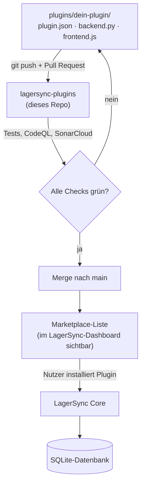
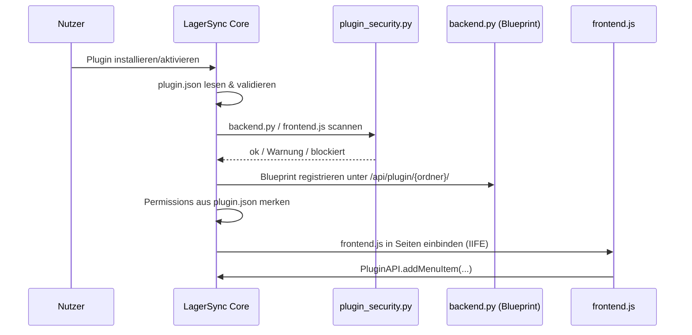
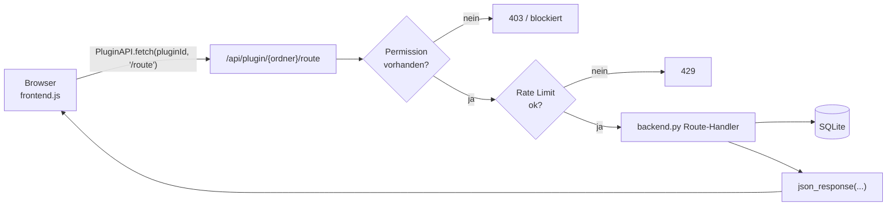
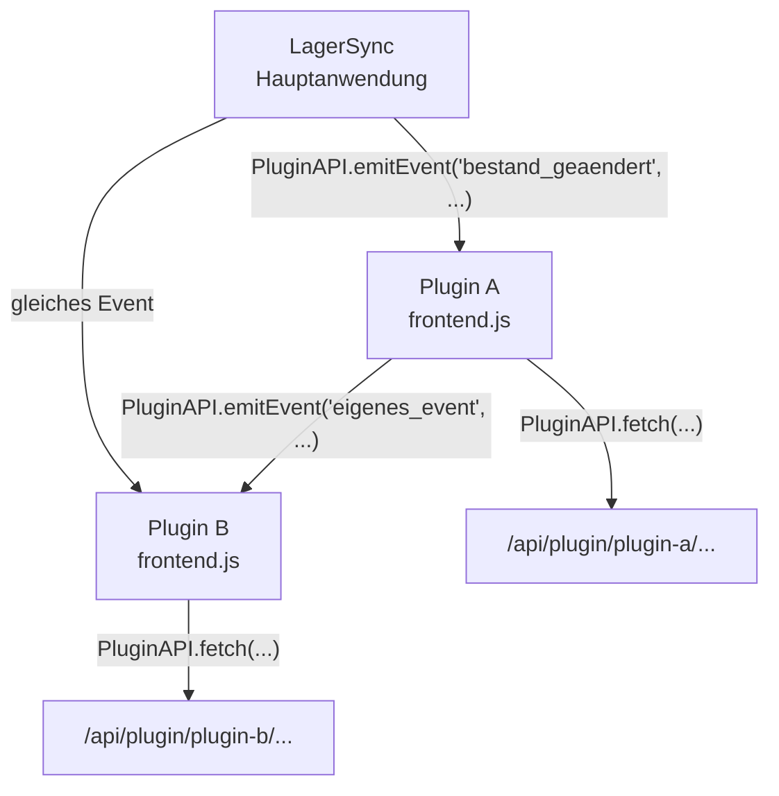

# 🏗 Architecture

Wie ein Plugin technisch in LagerSync eingebunden wird – für Entwickler und besonders hilfreich für KI-Agenten, die das System schnell verstehen müssen.

---

## Überblick



Dieses Repository ist **nur der Marketplace** – ein Katalog aus Plugin-Quellcode plus automatisierten Checks. Es enthält keine Laufzeitlogik. Geladen und ausgeführt werden Plugins von der LagerSync-Hauptanwendung.

---

## Was passiert beim Laden eines Plugins



Wichtig: **Permissions, Signatur-Prüfung und Code-Scan laufen serverseitig beim Laden** – nicht nur einmalig bei der PR-Review. Details dazu in [SECURITY.md](SECURITY.md).

---

## Die drei Bausteine eines Plugins

```
plugins/
└── mein-plugin/
    ├── plugin.json     ← Manifest: Name, Version, Permissions (Pflicht)
    ├── plugin.sig       ← Ed25519-Signatur (nur verifizierte Plugins)
    ├── backend.py       ← Flask Blueprint, läuft serverseitig (optional)
    └── frontend.js       ← Browser-Code, läuft im Client (optional)
```

| Datei | Wo läuft sie? | Wer injiziert was? |
|---|---|---|
| `plugin.json` | wird vom Core gelesen | – |
| `backend.py` | im Flask-Prozess von LagerSync | Core injiziert `get_db_connection()`, `require_auth()`, `json_response()`, `session`, u.a. – siehe [PLUGINS.md](PLUGINS.md#injizierte-variablen) |
| `frontend.js` | im Browser jedes Nutzers | Core injiziert `pluginId` und stellt `PluginAPI` global bereit |

Ein Plugin kann auch **nur** `plugin.json` haben (z.B. ein reines Theme/Design-Plugin ohne eigenen Code) – siehe `pro-design` in `plugins/`.

---

## Anfrage-Fluss zur Laufzeit



Jede Backend-Route eines Plugins ist automatisch unter `/api/plugin/{plugin-ordner-name}/{route}` erreichbar – siehe [PLUGINS.md](PLUGINS.md#routen-urls).

---

## Datenfluss zwischen Plugins und Hauptanwendung

Plugins kommunizieren mit der Hauptanwendung über zwei Kanäle, nicht direkt über geteilten Zustand:

1. **Events** – die Hauptanwendung löst Events aus (`bestand_geaendert`, `produkt_erstellt`, `produkt_geloescht`, `standort_gewechselt`), auf die `frontend.js` per `PluginAPI.onEvent(...)` reagieren kann. Plugins können auch eigene Events per `PluginAPI.emitEvent(...)` auslösen, auf die andere Plugins reagieren.
2. **HTTP über `PluginAPI.fetch()`** – für alles, was Daten aus der Datenbank braucht oder serverseitige Logik erfordert.



Das hält Plugins voneinander entkoppelt: Plugin A muss nichts über Plugin B's internen Code wissen, um auf dessen Events zu reagieren.

---

## Warum vier Plugin-Typen reichen, um das System zu verstehen

In [EXAMPLES.md](EXAMPLES.md) bauen wir bewusst auf den einfachsten Fall auf:

1. **Minimal** – nur `plugin.json`, kein Code (z.B. ein Theme)
2. **Backend-only** – eigene API-Route + DB-Tabelle, kein UI
3. **Frontend-only** – nur UI, keine eigene API
4. **Fullstack** – Backend + Frontend + eigene DB-Tabelle + Tenant-Isolation

Die echten Plugins in `plugins/` (`ki-assistent`, `low_stock_notifications`, `sso`) sind alle production-grade Fullstack-Plugins mit mehreren hundert Zeilen Code – gut als Referenz, aber zu komplex als erster Einstieg.

---

## Repository-Struktur (Marketplace, nicht LagerSync selbst)

```
lagersync-plugins/
├── plugins/                     ← ein Ordner pro Plugin
├── tests/                       ← automatisierte Plugin-Tests (laufen bei jedem PR)
├── docs/                        ← PLUGINS.md, PLUGINS_KI.md, EXAMPLES.md, ARCHITECTURE.md, SECURITY.md
├── .github/
│   ├── CODEOWNERS               ← Pflicht-Review durch Maintainer bei jedem PR
│   ├── dependabot.yml
│   ├── workflows/
│   │   ├── test.yml             ← CI: pytest + CodeQL + SonarCloud + PR-Kommentar-Bot
│   │   └── update-readme.yml    ← regeneriert README.md/README_EN.md bei jedem Push nach main
│   └── scripts/
│       ├── pr_review_analyzer.py
│       └── update_readme.py     ← liest plugins/*/plugin.json, schreibt Plugin-Tabelle + Badge
├── CONTRIBUTING.md
├── CHANGELOG.md
├── FAQ.md
├── README.md / README_EN.md
└── LICENSE
```

> Die Plugin-Tabelle und der „X verfügbar"-Badge in README.md/README_EN.md werden **nicht mehr manuell gepflegt** – `update_readme.py` generiert sie aus `plugins/*/plugin.json` neu, sobald auf `main` gepusht wird (als automatischer PR, nicht als Direkt-Commit). Die deutsche Beschreibung kommt aus `description`; für neue, noch unsignierte Plugins kannst du zusätzlich `description_en` setzen. Bei den vier bereits verifizierten Plugins steht die englische Übersetzung stattdessen in einer kleinen Tabelle direkt im Skript, weil eine Änderung an deren `plugin.json` die Ed25519-Signatur invalidieren würde – siehe [SECURITY.md](SECURITY.md#3-ed25519-signaturen).
